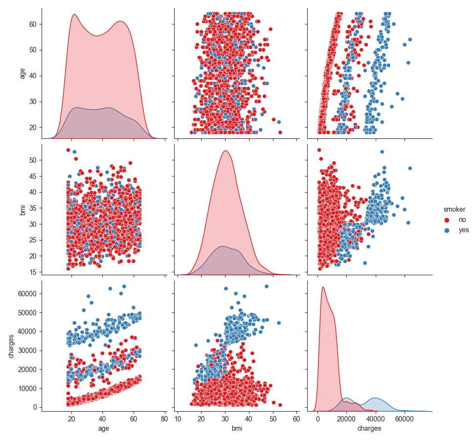

# Insurance Cost Prediction with Linear Regression

[](LICENSE)
<a href="https://github.com/Amir-Shamsi/SpAlgo" title="Repo Size">

</a>
[](http://python.org)
[](https://github.com/Amir-Shamsi/)

Implemetation of cost prediction for medical insurance using linear regression with python.

## Dataset
you can see the data set [here](dataset/insurance.csv):

<div align="center">

| &nbsp; age &nbsp; |  &nbsp; &nbsp; &nbsp; sex &nbsp; &nbsp; &nbsp; 	| &nbsp; &nbsp; &nbsp; bmi &nbsp; &nbsp; &nbsp;  | &nbsp; &nbsp; &nbsp; children &nbsp; &nbsp; &nbsp;  | &nbsp; &nbsp; &nbsp; smoker &nbsp; &nbsp; &nbsp;  |  &nbsp; &nbsp; &nbsp; region &nbsp; &nbsp; &nbsp;  |  &nbsp; &nbsp; &nbsp; charges &nbsp; &nbsp; &nbsp;  |
| :---: | :---: | :---: | :---: | :---: | :---: | :---: |
19 | female | 27.9 | 0 | yes | southwest | 16884.924
18 | male | 33.77 | 1 | no | southeast | 1725.5523
28 | male | 33 | 3 | no | southeast | 4449.462
33 | male | 22.705 | 0 | no | northwest | 21984.47061
32 | male | 28.88 | 0 | no | northwest | 3866.8552
31 | female | 25.74 | 0 | no | southeast | 3756.6216
46 | female | 33.44 | 1 | no | southeast | 8240.5896
37 | female | 27.74 | 3 | no | northwest | 7281.5056
... | ... | ... | ... | ... | ... | ...

  overview of what our dataset is.
  
</div>


## Data visualization
you can analyze data using the following code:
```python
from predictor import InsuranceCostPredictor

icp = InsuranceCostPredictor('dataset/insurance.csv')
icp.analyze(hue='smoker', based_on=['age', 'bmi', 'smoker', 'charges'])
```
see the [example](src/example/insurance_cost.py) file to undrestand exactly how to use it.

<p align="center">
  
</p>

## Libraries
to implement this project this libraries have been used:
 - pandas
 - matplotlib
 - sklearn
 - seaborn

## Installation
1. clone project using this code in you shell:

    ```sh
    git clone https://github.com/Amir-Shamsi/insurance-cost-prediction-LR/.git
    ```
2. install requirements

    ```sh
    pip install -r requirements.txt
    ```
3. Done 👾
